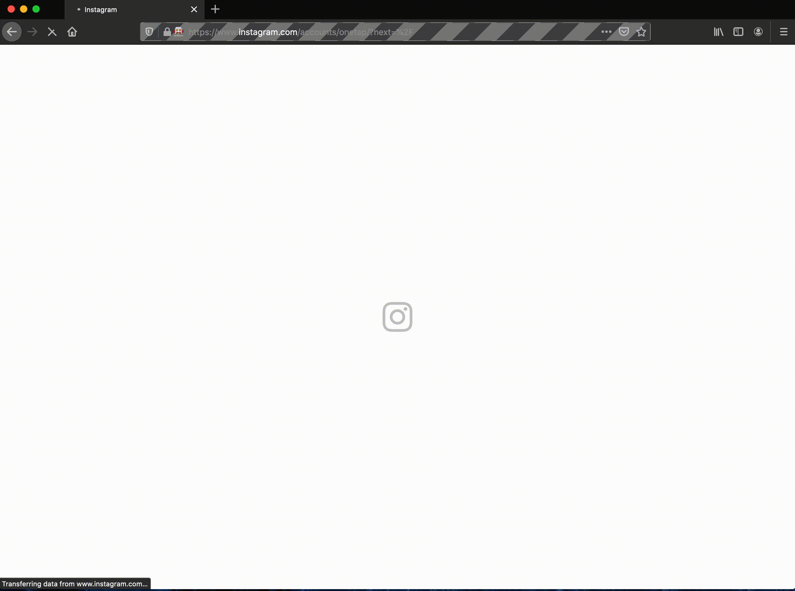
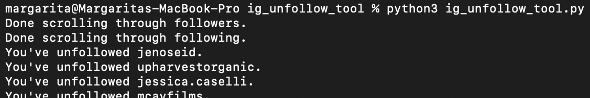

# Instagram Unfollow Tool
Automatically unfollow accounts that don't follow you back on Instagram. 

## Running the code
You must have Firefox, Python 3, and Selenium Python installed on your computer. 

Download [ig_unfollow_tool.py](ig_unfollow_tool.py). Update lines 189-190 with your account credentials. Open the terminal and run ```python3 tweet_quote.py```.

Here's what you'll see on screen as the code runs:

 
 

And in your terminal:

 
